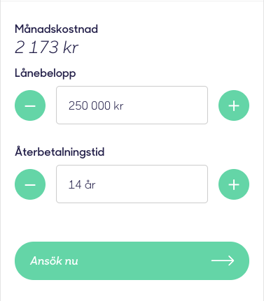

# Lånekalkylator

### Beskrivning
Uppgiften består av att göra en lånekalkylator likt den som finns på zmarta.se. 
Testet innefattar både HTML, CSS och Javascript för att du ska kunna visa dina kunskaper inom området.

### Instruktioner
Med hjälp av ett skal av HTML så ber vi dig att göra en kalkylator så likt bilden nedan som möjligt. 
Vi ser gärna att du använder Vue.js eller liknande för att lösa uppgiften. 
Du får använda de hjälpmedel du känner att du vill och behöver, du behöver inte uppfinna hjulet på nytt.  

Det finns vissa punkter som vi vill att du följer.
* Standardvärde för lånebeloppet och återbetalningstid är 250 000 kr respektive 14 år.
* Lånebeloppet ska vara mellan 5 000 och 600 000 kr.
* Återbetalningstiden ska vara mellan 1 och 15 år.
* Plus- och minussymbolerna ska öka respektive minska värdena.
* Lånebeloppet ska minskas/ökas med 5 000 åt gången.
* Återbetalningstiden ska ökas/minskas med 1 år åt gången.
* I `getContent()` i `main.js` finns det fördefinierade värde som bör användas istället för de hårdkodade som finns. Lägg till fält om du känner att du behöver. 
* Månadskostnaden ska beräknas med hjälp av medföljande formel i `main.js`. 

Vi vill att du gör ditt bästa men har full förståelse för att du inte hinner med allt under tidsramen. 
Prioritera det som ska göras så att du står där med en så fullt fungerande lösning som möjligt när tiden är slut.
Vi vill gärna höra vad du hade gjort annorlunda om du hade fått mer tid på dig. 